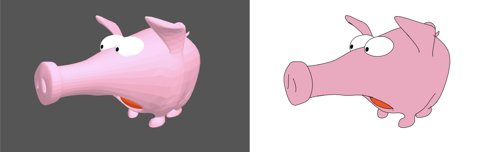

# three-svg-rendering

[](https://github.com/LokiResearch/three-svg-rendering/actions?query=workflow:"build")
[](https://github.com/LokiResearch/three-svg-rendering/releases/)
[](https://lgtm.com/projects/g/minitoine/three-svg-rendering/context:javascript)
[](#license)

### A **experimental** SVG renderer based on threejs to render 3D scenes as Vector Graphics.

Instead of basically drawing all the objects triangles which produces a **HUGE** svg file (such as threejs embedded SVGRenderer), this renderer analyzes the geometry to compute visible and hidden contours to draw (e.g. such as Freestyle renderer in Blender). Feel free to test the demo!




## Examples

[Online SVG Renderer Demo](https://lokiresearch.github.io/three-svg-rendering/build/examples/RendererDemo.html)

## Install

#### From GitHub
```bash
npm i git+https://github.com/LokiResearch/three-svg-rendering.git
```


## How to use

```ts
const scene = new THREE.Scene();
const camera = new THREE.Camera();

// Setup the svg meshes
const meshes = new Array<SVGMesh>();
scene.traverse(obj => {
  obj.isMesh && meshes.push(new SVGMesh(obj as THREE.Mesh));
});

// Setup the svg renderer and add pass to it
const svgRenderer = new SVGRenderer();

// This pass will draw fills for meshes using the three.js material color
const fillsPass = new FillsDrawPass();

// This pass will draw visible contours of meshes on top of fills
// using black color and solid line of width 1
const visibleContoursPass = new VisibleContoursDrawPass({
  color: "#000000",
  width: 1
});

// This pass will draw hidden contours on top of visible and fills
// using red color, dash line of width 1
const hiddenContoursPass = new HiddenContoursDrawPass({
  color: "#FF0000",
  width: 1,
  dashArray: "2,2"
});

svgRender.addDrawPass(fillsPass);
svgRender.addDrawPass(visibleContoursPass);
svgRender.addDrawPass(hiddenContoursPass);

// Get the svg and render info
const info = new SVGRenderInfo();
svgRenderer.generateSVG(meshes, camera, {w: 1000, h:1000}, {}, info).then(svg => {
  console.log(info);
  // Save svg as file, display it in the DOM, etc
});

```


## Documentation

*Real generated documentation to come.*


### SVGRenderer

```ts
class SVGRenderer {
    readonly viewmap: Viewmap;
    readonly svgBuilder: SVGBuilder;
    generateSVG(
      meshes: Array<SVGMesh>, 
      camera: PerspectiveCamera, 
      size: {w: number; h: number;},
      options?: SVGRenderOptions,
      info?: SVGRenderInfo): Promise<Svg>;
    addDrawPass(pass: DrawPass): void;
    removeDrawPass(pass: DrawPass): void;
    clearDrawPasses(): void;
}
```

```ts
interface SVGRenderOptions {
    updateMeshes?: boolean;
    viewmap?: ViewmapBuildOptions;
    svg?: SVGBuildOptions;
}
```

### SVGMesh

```ts
class SVGMesh {
    readonly threeMesh: Mesh;
    readonly morphGeometry: BufferGeometry;
    readonly hes: HalfEdgeStructure;
    readonly bvh: MeshBVH;
    constructor(mesh: Mesh, options?: SVGMeshOptions);
    updateMorphGeometry(): void;
    updateBVH(updateMorphGeometry?: boolean): void;
    updateHES(updateMorphGeometry?: boolean): void;
    dispose(): void;
    useBVHRaycast(use: boolean): void;
}
```

```ts
interface SVGMeshOptions {
    bvhOptions?: MeshBVHOptions;
    hesOptions?: HalfEdgeStructureOptions;
    replaceMeshRaycastFunc?: boolean;
}
```

### Viewmap

```ts
interface ViewmapBuildOptions {
    meshesNeedUpdate?: boolean;
    ignoreContoursVisibility?: boolean;
    defaultMeshColor?: ColorRepresentation;
}
```

### SVGBuilder

```ts
interface SVGBuildOptions {
    prettifySVG: boolean;
}
```

### DrawPass

```ts
abstract class DrawPass {
    name: string;
    constructor();
    /**
     * Function automatically called by SVGBuilder
     * @param svg The svg tree being built
     * @param viewmap The viewmap data structure
     */
    abstract draw(svg: Svg, viewmap: Viewmap): Promise<void>;
}
```

Can be inherited to add custom passes to the SVG renderer.

### Passes

```ts
interface ContoursDrawPassOptions {
    useRandomColors: boolean;
    groupByNature: boolean;
    drawContourId: boolean;
    drawRaycastPoint: boolean;
}
```

```ts
class VisibleContoursDrawPass extends ContoursDrawPass {
    constructor(strokeStyle?: StrokeData, options?: Partial<ContoursDrawPassOptions>);
    draw(svg: Svg, viewmap: Viewmap): Promise<void>;
}
```

```ts
class HiddenContoursDrawPass extends ContoursDrawPass {
    constructor(strokeStyle?: StrokeData, options?: Partial<ContoursDrawPassOptions>);
    draw(svg: Svg, viewmap: Viewmap): Promise<void>;
}
```

```ts
interface FillsDrawPassOptions {
    drawRaycastPoint: boolean;
    drawPolygonId: boolean;
    useRandomColors: boolean;
    useFixedFillColor: boolean;
}
```

```ts
class FillsDrawPass extends DrawPass {
    readonly options: FillsDrawPassOptions;
    readonly fillStyle: FillData;
    constructor(fillStyle?: FillData, options?: Partial<FillsDrawPassOptions>);
    draw(svg: Svg, viewmap: Viewmap): Promise<void>;
}
```


## References

- Pierre Bénard, Aaron Hertzmann. Line drawings from 3D models: a tutorial. Foundations and Trends in Computer Graphics and Vision, Now Publishers, 2019, 11 (1-2), pp.159. [https://hal.inria.fr/hal-02189483](https://hal.inria.fr/hal-02189483)
- Elmar Eisemann, Holger Winnenmöller, John C. Hart, David Salesin. Stylized Vector Art from 3D Models with Region Support. Computer Graphics Forum, Wiley, 2008, Special Issue: Proceedings of the 19th Eurographics Symposium on Rendering 2008, 27 (4), pp.1199--1207. [https://hal.inria.fr/inria-00345295](https://hal.inria.fr/inria-00345295)
- Stéphane Grabli, Emmanuel Turquin, Frédo Durand, François X. Sillion. Programmable Style for NPR Line Drawing. Rendering Techniques 2004 (Eurographics Symposium on Rendering), 2004, Norrköping, Sweden. [https://hal.inria.fr/inria-00510169](https://hal.inria.fr/inria-00510169)

